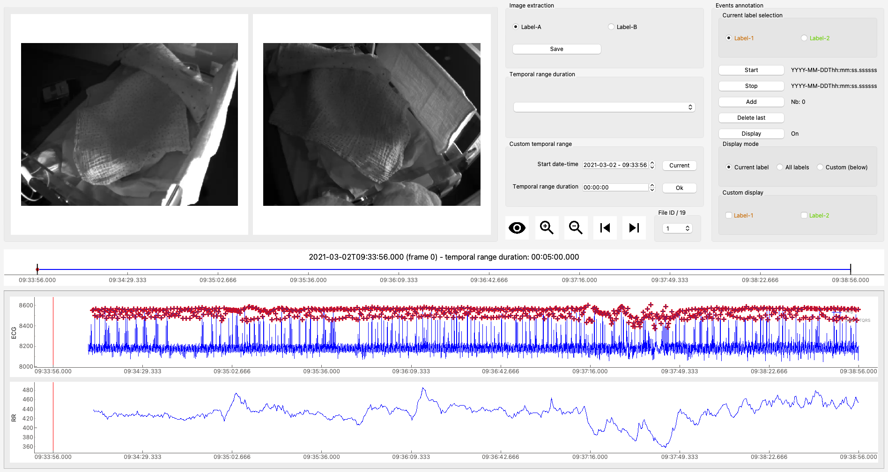

ViSiAnnoT
=========

**ViSiAnnoT** (Video Signal Annotation Tool) is a package that provides a graphical user interface for the visualization and annotation of video and signal data.

The main features are:

- Simultaneous visualization of several videos
- Simultaneous visualization of several signals

    - Regularly sampled or not
    - Zoom on signals
    - Plot thresholds on signals
    - Plot temporal intervals on signals
- Combined visualization of videos and signals
- Management of long recordings (split in several files)

    - Automatic synchronization between the different modalities
    - Tools for fast navigation
- Multi-label annotation of temporal events
- Multi-label image extraction
- Configuration via a graphical user interface

Depedencies
-----------

It mainly relies on [PyQt5](https://pypi.org/project/PyQt5/) for the GUI, on [PyQtGraph](http://pyqtgraph.org/) for video and signal plots and on [OpenCV](https://opencv.org/) for loading video data. Saving and loading configuration files is achieved with [Configobj](https://pypi.org/project/configobj/). [Pytz](https://pypi.org/project/pytz/) is used for date-time comparison. [H5py](https://pypi.org/project/h5py/) is used for reading hdf5 files.

The other packages are rather common in most Python distributions.

Here is an exhaustive list of required packages: 

* ast
* collections
* configobj
* cv2
* datetime
* glob
* h5py
* numpy
* os
* pickle
* PyQt5
* pyqtgraph
* pytz
* scipy
* shutil
* sys
* threading
* time
* wave

Installation
------------
TODO

Documentation
-------------
TODO

Used by
-------
**ViSiAnnoT** has been used in several clinical studies during the time of initial developments, with a particular focus in pediatrics. In particular, it has been used in a study on quiet sleep organization that has been published in the following article, where is introduced **ViSiAnnoT**: [Quiet Sleep Organization of Very Preterm Infants Is Correlated With Postnatal Maturation](https://www.frontiersin.org/articles/10.3389/fped.2020.559658/full).
