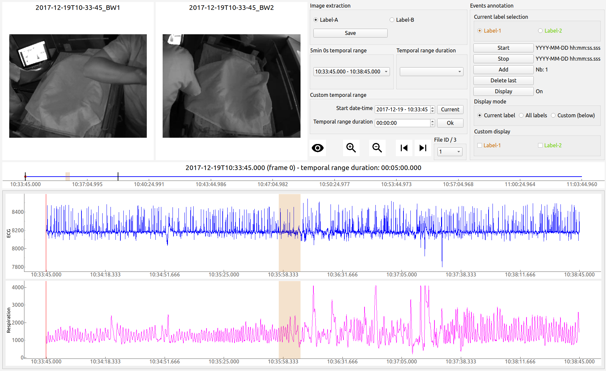

============
Introduction
============

**ViSiAnnoT** (Video Signal Annotation Tool) is a package that provides a graphical user interface for the visualization and annotation of video and signal data.

The main features are:

- Simultaneous visualization of several videos
- Simultaneous visualization of several signals

    - Regularly sampled or not
    - Zoom on signals
    - Plot thresholds on signals
    - Plot temporal intervals on signals
- Combined visualization of videos and signals
- Management of long recordings (split in several files)

    - Automatic synchronization between the different modalities
    - Tools for fast navigation
- Multi-label annotation of temporal events
- Multi-label image extraction
- Configuration via a graphical user interface

  Screenshot of ViSiAnnoT
