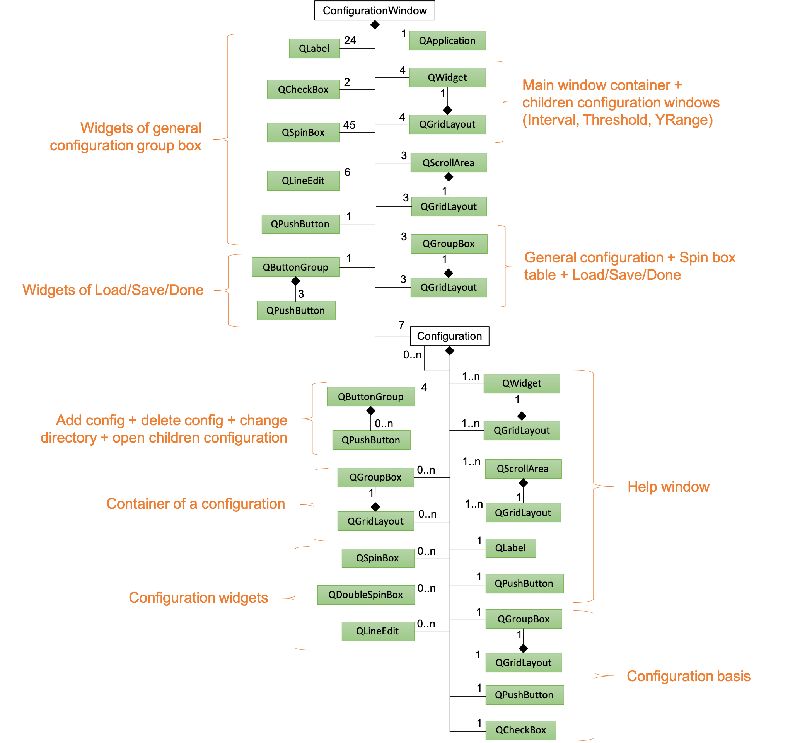
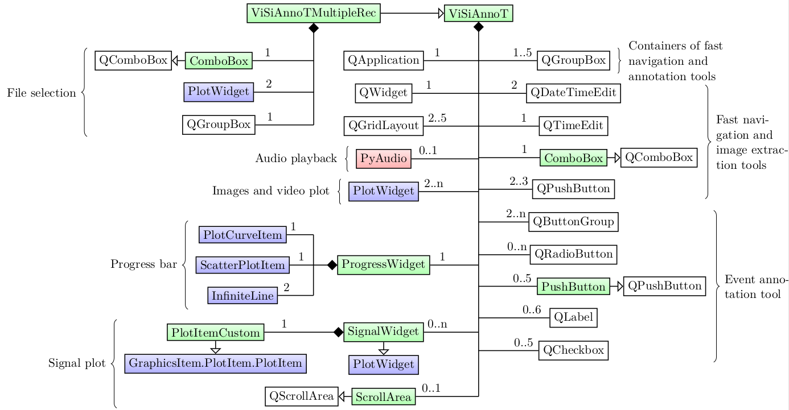

====================
Software description
====================

Trew view of source files
=========================

The tree view of source files is reported below::

  |__ visiannot
      |__ visiannot/configuration
          |__ Configuration.py
          |__ ConfigurationWindow.py
          |__ __init__.py
          |__ update.py
      |__ visiannot/tools
          |__ ToolsAnnotation.py
          |__ ToolsAudio.py
          |__ ToolsData.py
          |__ ToolsDateTime.py
          |__ ToolsImage.py
          |__ ToolsPyQt.py
          |__ ToolsPyqtgraph.py
          |__ __init__.py
      |__ visiannot/visiannot
          |__ visiannot/visiannot/components
              |__ visiannot/visiannot/components/Images
                  |__ DIGI-NEWB.jpg
                  |__ next.jpg
                  |__ previous.jpg
                  |__ visibility.jpg
                  |__ zoomin.jpg
                  |__ zoomout.jpg
              |__ MenuBar.py
              |__ Signal.py
              |__ WindowsPopUp.py
              |__ __init__.py
              |__ AnnotEventWidget.py
              |__ AnnotImageWidget.py
              |__ CustomTemporalRangeWidget.py
              |__ FileSelectionWidget.py
              |__ FromCursorTemporalRangeWidget.py
              |__ LogoWidgets.py
              |__ ProgressWidget.py
              |__ SignalWidget.py
              |__ TruncTemporalRangeWidget.py
              |__ VideoWidget.py
          |__ ViSiAnnoT.py
          |__ ViSiAnnoTLongRec.py
          |__ ViSiAnnoTLongRecFromConfigFile.py
          |__ ViSiAnnoTLongRecFromConfigGUI.py
          |__ __init__.py
      |__ __init__.py
      |__ __main__.py
  |__ exe_generation
      |__ convert_img_to_icon.py
      |__ visiannot.spec
  |__ doc
      |__ doc/source
          |__ doc/source/images
             |__ ...
          |__ doc/source/APIreference
       |__ ...
          |__ conf.py
          |__ exe.rst
          |__ install.rst
          |__ software.rst
          |__ further.rst
          |__ userguide-toolspyqtgraph.rst
          |__ intro.rst
          |__ license.rst
          |__ userguide-configuration.rst
          |__ userguide-toolspyqt.rst
          |__ userguide-visiannot.rst
          |__ customization.rst
          |__ summaryGroups.py
          |__ cfg.py
          |__ support.rst
      |__ Makefile
      |__ README.txt
      |__ requirements.txt
      |__ autoDocAPI.py
  |__ README.md
  |__ LICENSE.txt
  |__ setup.py
  |__ .readthedocs.yaml
  |__ .gitignore
  |__ MANIFEST.in

The package **visiannot** is structured as follows:

* The sub-package **visiannot.configuration** contains the classes for the GUI configuration tool,

* The sub-package **visiannot.tools** contains the following modules:

  * :mod:`.ToolsAnnotation`: functions for reading annotation files,

  * :mod:`.ToolsAudio`: functions for loading audio files,

  * :mod:`.ToolsData`: functions for loading data in format txt, h5 or mat as well as doing some basic processing,

  * :mod:`.ToolsDateTime`: functions for converting and formatting date/times,

  * :mod:`.ToolsImage`: functions for loading images and video data,

  * :mod:`.ToolsPyQt`: **PyQt5** sub-classes and functions that ease GUI creation,

  * :mod:`.ToolsPyqtgraph`: **Pyqtgraph** sub-classes and functions that ease creation of scientific graphics,

* The sub-package **visiannot.visiannot** contains the classes defining the GUI for multimodal data visualization and annotation, as well as the sub-package **visiannot.components** that contains the classes defining the GUI components.

The folder **exe_generation** contains the configuration file in order to generate an executable file (see :ref:`exe`).

The folder **doc** contains the files for generating local html documentation with `Sphinx <https://www.sphinx-doc.org/en/master/index.html>`_.

The files *setup.py* and *MANIFEST.in* are used to publish the package on **PyPI**.

The file *.readthedocs.yaml* is useful for the documentation generation on **ReadTheDocs**.

Class diagrams
==============

Configuration
-------------

Figure :numref:`fig-class-diagram-config` is the class diagram of :class:`.ConfigurationWindow`, which launches the configuration GUI (see :ref:`config-gui`).

.. _fig-class-diagram-config:

  Class diagram of :class:`.ConfigurationWindow` (attributes and methods are not provided), classes from PyQt5.QtWidgets are hightlighted in green

The windows are contained in an instance of **QWidgets** filled with an instance of **QGridLayout**. There is one instance for the main window and three other instances for the children configuration windows (interval, threshold, Yrange). For each window of child configuration, an instance of **QScrollArea** is created.

The class :class:`.Configuration` is used to create and set configurations. There are 7 instances: video, signal, threshold, interval, Yrange, events annotation and image annotation. An instance of :class:`.Configuration` can have a list of :class:`.Configuration` children. In particular, the signal configuration has 2 children: threshold and interval.

ViSiAnnoT
---------

Figure :numref:`fig-class-diagram-visiannot` is the class diagram of :class:`.ViSiAnnoTLongRec`, which launches ViSiAnnoT in the context of long recordings (see section :ref:`sec-longrec`).

.. _fig-class-diagram-visiannot:

  Class diagram of :class:`.ViSiAnnoTMultipleRec` (attributes and methods are not provided), classes from PyQt5.QtWidgets are hightlighted in green, classes from pyqtgraph are hightlighted in blue

:class:`.ViSiAnnoTMultipleRec` inherits from :class:`.ViSiAnnoT`.

The class :class:`.ProgressWidget` defines the progress bar. It is composed of an instance of **PlotCurveItem** for the background blue line, an instance of **ScatterPlotItem** for the current position cursor (red dot) and two instances of **InfiniteLine** for the current temporal range bounds.

The class :class:`.SignalWidget` defines the widgets for plotting signals. It inherits from **PlotWidget**. The constructor is re-implemented so that an instance of :class:`.PlotItemCustom` is used as the central item of the widget. :class:`.PlotItemCustom` inherits from **GraphicsItem.PlotItem.PlotItem**, so that the effect of the "auto-range" button is only applied on the Y axis. We re-implemented the **QScrollArea** class in :class:`.ScrollArea` so that we can add a scroll area containing the signal widgets while ignoring the wheel event for scrolling. Thus, the wheel event is only applied on the plot items.

