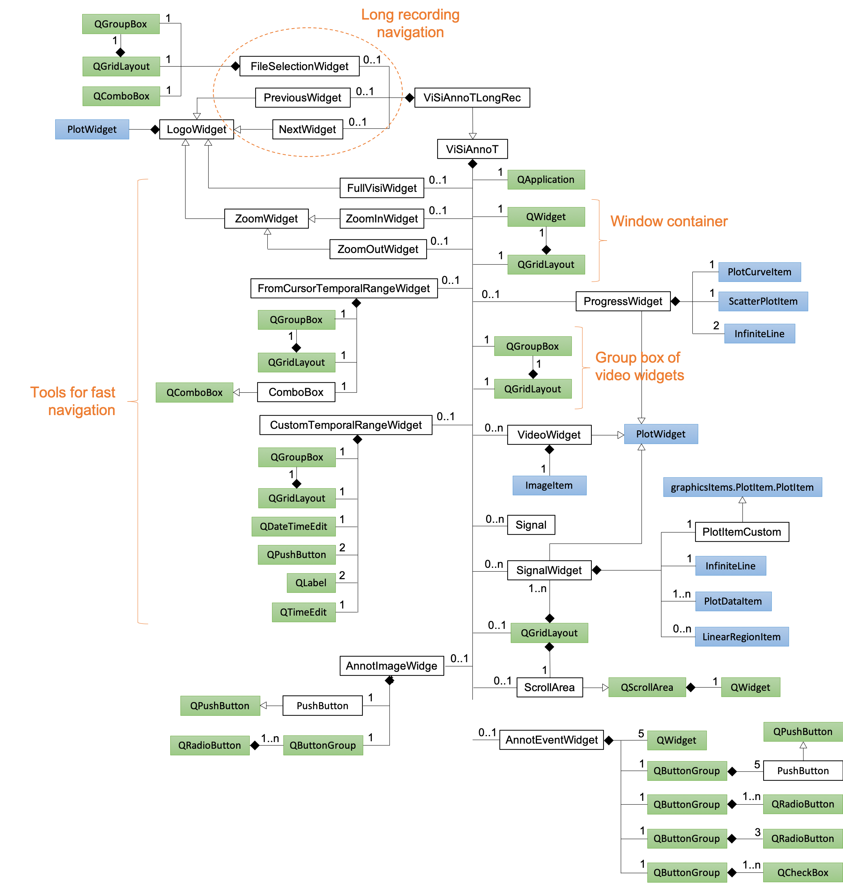

====================
Software description
====================

Trew view of source files
=========================

The tree view of source files is reported below::

  |__ visiannot
      |__ visiannot/configuration
          |__ Configuration.py
          |__ ConfigurationWindow.py
          |__ __init__.py
          |__ configUpdateExamples.py
      |__ visiannot/tools
          |__ ToolsAnnotation.py
          |__ ToolsAudio.py
          |__ ToolsData.py
          |__ ToolsDateTime.py
          |__ ToolsImage.py
          |__ ToolsPyQt.py
          |__ ToolsPyqtgraph.py
          |__ __init__.py
      |__ visiannot/visiannot
          |__ visiannot/visiannot/components
              |__ visiannot/visiannot/components/Images
                  |__ DIGI-NEWB.jpg
                  |__ next.jpg
                  |__ previous.jpg
                  |__ visibility.jpg
                  |__ zoomin.jpg
                  |__ zoomout.jpg
              |__ MenuBar.py
              |__ Signal.py
              |__ WindowsPopUp.py
              |__ __init__.py
              |__ AnnotEventWidget.py
              |__ AnnotImageWidget.py
              |__ CustomTemporalRangeWidget.py
              |__ FileSelectionWidget.py
              |__ FromCursorTemporalRangeWidget.py
              |__ LogoWidgets.py
              |__ ProgressWidget.py
              |__ SignalWidget.py
              |__ TruncTemporalRangeWidget.py
              |__ VideoWidget.py
          |__ ViSiAnnoT.py
          |__ ViSiAnnoTLongRec.py
          |__ ViSiAnnoTLongRecFromConfigFile.py
          |__ ViSiAnnoTLongRecFromConfigGUI.py
          |__ __init__.py
      |__ __init__.py
      |__ __main__.py
  |__ exe_generation
      |__ convert_img_to_icon.py
      |__ visiannot.spec
  |__ doc
      |__ doc/source
          |__ doc/source/images
             |__ ...
          |__ doc/source/APIreference
       |__ ...
          |__ conf.py
          |__ exe.rst
          |__ install.rst
          |__ software.rst
          |__ further.rst
          |__ userguide-toolspyqtgraph.rst
          |__ intro.rst
          |__ license.rst
          |__ userguide-configuration.rst
          |__ userguide-toolspyqt.rst
          |__ userguide-visiannot.rst
          |__ customization.rst
          |__ summaryGroups.py
          |__ cfg.py
          |__ support.rst
      |__ Makefile
      |__ README.txt
      |__ requirements.txt
      |__ autoDocAPI.py
  |__ README.md
  |__ LICENSE.txt
  |__ setup.py
  |__ .readthedocs.yaml
  |__ .gitignore
  |__ MANIFEST.in

The package **visiannot** is structured as follows:

* The sub-package **visiannot.configuration** contains the classes for the GUI configuration tool,

* The sub-package **visiannot.tools** contains the following modules:

  * :mod:`.ToolsAnnotation`: functions for reading annotation files,

  * :mod:`.ToolsAudio`: functions for loading audio files,

  * :mod:`.ToolsData`: functions for loading data in format txt, h5 or mat as well as doing some basic processing,

  * :mod:`.ToolsDateTime`: functions for converting and formatting date/times,

  * :mod:`.ToolsImage`: functions for loading images and video data,

  * :mod:`.ToolsPyQt`: **PyQt5** sub-classes and functions that ease GUI creation,

  * :mod:`.ToolsPyqtgraph`: **Pyqtgraph** sub-classes and functions that ease creation of scientific graphics,

* The sub-package **visiannot.visiannot** contains the classes defining the GUI for multimodal data visualization and annotation, as well as the sub-package **visiannot.components** that contains the classes defining the GUI components.

The folder **exe_generation** contains the configuration file in order to generate an executable file (see :ref:`exe`).

The folder **doc** contains the files for generating local html documentation with `Sphinx <https://www.sphinx-doc.org/en/master/index.html>`_.

The files *setup.py* and *MANIFEST.in* are used to publish the package on **PyPI**.

The file *.readthedocs.yaml* is useful for the documentation generation on **ReadTheDocs**.

Class diagrams
==============

WARNING!!! DIAGRAMS DEPRECATED, TO BE UPDATED

Configuration
-------------

Figure :numref:`fig-class-diagram-config` is the class diagram of \textbf{ConfigurationWindow} class which launches the configuration tool (see section \ref{sec:configuration}). It is composed of classes from PyQt5.QtWidgets.

.. _fig-class-diagram-config:

  Class diagram of :class:`.ConfigurationWindow` (attributes and methods are not provided) where the classes we implemented are highlighted in green and the other classes are from PyQt5.QtWidgets

**QApplication** class is necessary for the GUI to run.

**QWidget** class contains a window. There are 3 windows. An instance of **QGridLayout** is associated to each window and is the layout to fill. An instance of **QScrollArea** is associated to each window.

There are 5 instances of **QGroupBox** that are present in the 3 windows at launch, each one of them has an associated instance of **QGridLayout** for filling.

The instance of **QButtonGroup** groups the push buttons for loading and saving configuration files as well as closing the window.

We implemented the :class:`.Configuration` class for creating and setting configurations. There are 5 instances: video, signal, threshold, interval and annotation. Each one of them is added to a layout (**QGridLayout**). Every time the user creates a configuration, an instance of **QGroupBox** and its associated layout (**QGridLayout**) are added. An instance of :class:`.Configuration` can have a list of :class:`.Configuration` children. For example, in the configuration GUI, the signal configuration has 2 children: threshold and interval. There are 4 instances of **QButtonGroup**: for showing children windows, for adding a configuration, for deleting a configuration, for changing data directory. In some cases, they might be empty.

ViSiAnnoT
---------

Figure :numref:`fig-class-diagram-visiannot` is the class diagram of :class:`.ViSiAnnoTMultipleRec`, which launches ViSiAnnoT in the context of long recordings (see section :ref:`sec-longrec`).

.. _fig-class-diagram-visiannot:

  Class diagram of :class:`.ViSiAnnoTMultipleRec` (attributes and methods are not provided) where the classes we implemented are highlighted in green, the classes of pyaudio package are highlighted in red, the classes of pyqtgraph package are hightlighted in blue and the other classes are from PyQt5.QtWidgets

:class:`.ViSiAnnoTMultipleRec` inherits from :class:`.ViSiAnnoT`. The file selection in the long recordings is handled by 2 instances of **PlotWidget** with "previous" and "next" images and an instance of :class:`.ComboBox`. This class inherits from **QComboBox** so that keyboard interaction is ignored.

**QApplication** class is necessary for the GUI to run.

**QWidget** class contains the window, to which is associated an instance of **QGridLayout** for filling it.

There are between 1 and 4 instances of **QGroupBox**, each one of them has an associated instance of **QGridLayout** for filling. These group boxs contain fast navigations and/or annotation tools.

We implemented the :class:`.ProgressWidget` class for the progress bar. It is composed of an instance of **PlotCurveItem** for the background blue line, an instance of **ScatterPlotItem** for the current position cursor (red dot) and two instances of **InfiniteLine** for the current temporal range bounds.

We implemented the :class:`.SignalWidget` class for plotting signals. It inherits from **PlotWidget**. The constructor is re-implemented so that an instance of :class:`.PlotItemCustom` is used as the central item of the widget. :class:`.PlotItemCustom` inherits from **GraphicsItem.PlotItem.PlotItem**, so that the effect of the "auto-range" button is only applied on the Y axis. We re-implemented the **QScrollArea** class in :class:`.ScrollArea` so that we can add a scroll area containing the signal widgets while ignoring the wheel event for scrolling. Thus, the wheel event is only applied on the plot items.

