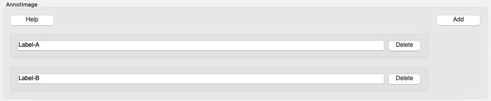
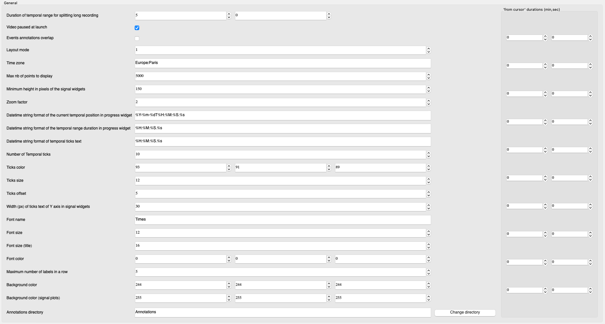

.. _configuration:

=========================
User guide: configuration
=========================

Previous section introduced the features of **ViSiAnnoT** and it goes to show that the software is highly configurable. The configuration might not be easy for people not familiar with computer sciences. So we provide a graphical tool for creating, loading and saving configurations, that we describe in this section.

The configuration of **ViSiAnnoT** can be be split in seven parts: video, signal, threshold, interval, events annotation, image extraction, general. There are three ways to achieve the configuration:

* Editing a Python script (both for :class:`.ViSiAnnoT` and :class:`.ViSiAnnoTLongRec`),
* Editing a configuration file complying with the formatting of **Configobj** package (only for :class:`.ViSiAnnoTLongRec`),
* Using the configuration tool that we provide, consisting in a graphical user interface (only for :class:`.ViSiAnnoTLongRec`).

Several examples on how to configure :class:`.ViSiAnnoT` and :class:`.ViSiAnnoTLongRec` in a script are given in the chapter :ref:`userguide-visiannot`.

Editing a configuration file
============================

Configuration files are managed with the **Configobj** package. See `this link <https://configobj.readthedocs.io/en/latest/configobj.html#the-config-file-format>`_ for details about text formatting inside the configuration file. Below we give examples that show how to configure :class:`.ViSiAnnoTLongRec`.

Video
-----

See section :ref:`video` for details about video configuration. In a Python script, it is stored in a dictionary as in the following example::

    video_dict = {}
    video_dict["BW1"] = ["dir/to/video", "*BW1*.mp4", '_', 0, "%Y-%m-%dT%H-%M-%S"]
    video_dict["BW2"] = ["dir/to/video", "*BW2*.mp4", '_', 0, "%Y-%m-%dT%H-%M-%S"]

In the configuration file, we create a section named "Video", composed of as much sub-sections as cameras. The name of the subsections is equivalent to the dictionary keys. Here is the equivalent video configuration::

    [Video]
    [[BW1]]
    k0 = "dir/to/video"
    k1 = "*BW1*.mp4"
    k2 = '_'
    k3 = 0
    k4 = "%Y-%m-%dT%H-%M-%S"
    [[BW2]]
    k0 = "dir/to/video"
    k1 = "*BW2*.mp4"
    k2 = '_'
    k3 = 0
    k4 = "%Y-%m-%dT%H-%M-%S"

The keys ``k*`` are arbitrary. The only constraint is that they must be different inside the same (sub-)section.

Same configuration with a more compact writing::

    [Video]
    BW1 = ["dir/to/video", "*BW1*.mp4", '_', 0, "%Y-%m-%dT%H-%M-%S"]
    BW2 = ["dir/to/video", "*BW2*.mp4", '_', 0, "%Y-%m-%dT%H-%M-%S"]

The brackets may be omitted::

    [Video]
    BW1 = "dir/to/video", "*BW1*.mp4", '_', 0, "%Y-%m-%dT%H-%M-%S"
    BW2 = "dir/to/video", "*BW2*.mp4", '_', 0, "%Y-%m-%dT%H-%M-%S"

The drawback of the compact writing is that it loses clarity for long lists as it is not allowed to span several lines for a single key (e.g. BW1).

Signal
------

See section :ref:`signal` for details about signal configuration. In a Python script, it is stored in a dictionary as in the following example::

    signal_dict = {}

    signal_dict["ECG"] = [
        ["dir/to/sig", "ecg", 500, "data_*.h5", '_', 1, 'posix', None],
        [
            "dir/to/sig", "tqrs", 0, "tqrs_*.h5", '_', 0, '%Y%m%dT%H%M%S',
            {'pen': None, "symbol": '+', "symbolPen": 'r', "symbolSize": 10}
        ]
    ]

    signal_dict["Respiration"] = [
        [
            "dir/to/sig", "resp", 62.5, "data_*.h5", '_', 1, 'posix',
            {'pen': {'color': 'm', 'width': 1}}
        ]
    ]

There are two signal widgets ("ECG" and "Repsiration"), with two signals in the first one and one signal in the second one. In the configuration file, we create a section named "Signal", composed of as much sub-sections as signal widgets. Each sub-section is composed of as much sub-sub-sections as signals in the corresponding signal widget. Here is the equivalent signal configuration::

    [Signal]
    
    [[ECG]]
    [[[k0]]]
    k0 = 'dir/to/sig'
    k1 = 'ecg'
    k2 = 500
    k3 = 'data_*.h5'
    k4 = '_'
    k5 = 1
    k6 = 'posix'
    k7 = None
    [[[k1]]]
    k0 = 'dir/to/sig'
    k1 = 'tqrs'
    k2 = 0
    k3 = 'tqrs_*.h5'
    k4 = '_'
    k5 = 0
    k6 = '%Y%m%dT%H%M%S'
    [[[[k7]]]]
    pen = None
    symbol = '+'
    symbolPen = 'r'
    symbolSize = 10

    [[Respiration]]
    [[[k0]]]
    k0 = 'dir/to/sig'
    k1 = 'resp'
    k2 = 62.5
    k3 = 'data_*.h5'
    k4 = '_'
    k5 = 1
    k6 = 'posix'
    [[[[k7]]]]
    [[[[[pen]]]]]
    color = 'm'
    width = 1

Same configuration with a more compact writing::

    [Signal]
    ECG = [['dir/to/sig', 'ecg', '500', 'data_*.h5', '_', 1, 'posix', None], ['dir/to/sig', 'tqrs', 0, 'tqrs_*.h5', '_', 0, '%Y%m%dT%H%M%S', {'pen': None, 'symbol': '+', 'symbolPen': 'r', 'symbolSize': 10}]]
    Respiration = [['dir/to/sig', 'resp', 62.5, 'data_*.h5', '_', 1, 'posix', {'pen': {'color': 'm', 'width': 1}}]]

Threshold
---------

See section :ref:`threshold` for details about threshold configuration. In a Python script, it is stored in a dictionary as in the following example::

    threshold_dict = {}
    threshold_dict["RR"] = [
        [600, (220, 0, 0)],
        [750, (178, 34, 34)]
    ]

In configuration file, we create a section named "Threshold", composed of as much sub-sections as threshold values. Here is the equivalent threshold configuration::

    [Threshold]
    [[RR]]
    [[[k0]]]
    k0 = 600
    k1 = [220, 0, 0]
    [[[k1]]]
    k0 = 750
    k1 = [178, 34, 34]

Same configuration with a more compact writing::

    [Threshold]
    [[RR]]
    key_0 = [600, [220, 0, 0]]
    key_1 = [750, [178, 34, 34]]

Interval
--------

See section :ref:`intervals` for details about interval configuration. In a Python script, it is stored in a dictionary as in the following example::

    interval_dict = {}
    interval_dict["ECG"] = [
        ["dir/to/interval", "", 500, "I0_*.txt", '_', 0, '%Y%m%dT%H%M%S', (0, 255, 0, 50)],
        ["dir/to/interval", "", 500, "I1_*.txt", '_', 0, '%Y%m%dT%H%M%S', (255, 200, 0, 50)]
    ]

Intervals must be plotted only the signal widget "ECG" with two interval types. In the configuration file, we create a section named "Interval", composed of as much sub-sections as signal widgets on which to plot intervals. Each sub-section is composed of as much sub-sub-sections as interval types to plot on the corresponding signal widget. Here is the equivalent interval configuration::

    [Interval]
    [[ECG]]
    [[[k0]]]
    k0 = "path/to/interval.txt"
    k1 = ''
    k2 = "I0_*.txt"
    k3 = 500
    k4 = '_'
    k5 = 0
    k6 = '%Y%m%dT%H%M%S'
    k7 = [0, 255, 0, 50]
    [[[k1]]]
    k0 = "path/to/intervalbis.txt"
    k1 = ''
    k2 = "I1_*.txt"
    k3 = 500
    k4 = '_'
    k5 = 0
    k6 = '%Y%m%dT%H%M%S'
    k7 = [255, 200, 0, 50]

Same configuration with a more compact writing::

    [Interval]
    ECG = [["dir/to/interval", "", 500, "I0_*.txt", '_', 0, '%Y%m%dT%H%M%S', [0, 255, 0, 50]], ["dir/to/interval", "", 500, "I1_*.txt", '_', 0, '%Y%m%dT%H%M%S', [255, 200, 0, 50]]]

Events annotation
-----------------

See section :ref:`eventsannot` for details about events annotation configuration. In a Python script, it is stored in a dictionary as in the following example::

    annotevent_dict = {}
    annotevent_dict["Label-1"] = [200, 105, 0, 50]
    annotevent_dict["Label-2"] = [105, 205, 0, 50]

In the configuration file, we create a section named "AnnotEvent", composed of as much sub-sections as labels. Here is the equivalent events annotation configuration::

    [AnnotEvent]
    [[Label-1]]
    k0 = 200
    k1 = 105
    k2 = 0
    k3 = 50
    [[Label-2]]
    k0 = 105
    k1 = 205
    k2 = 0
    k3 = 50

Same configuration with a more compact writing::

    [AnnotEvent]
    Label-1 = [200, 105, 0, 50]
    Label-2 = [105, 205, 0, 50]

Image extraction
----------------

See section :ref:`image-extraction` for details about image extraction configuration. In a Python script, it is stored in a list as in the following example::

    annotimage_list = ["Label-A", "Label-B", "Label-C"]

In the configuration file, we create a section named "AnnotImage"::

    [AnnotImage]
    k0 = "Label-A"
    k1 = "Label-B"
    k2 = "Label-C"

We must keep the dictionary structure because of the structure of the class :class:`.Configuration`. Nevertheless, it is converted to a list inside :class:`.ViSiAnnoT`.

General
-------

In a Python script, the general configuration is specified with the keyword arguments of :class:`.ViSiAnnoTLongRec` and :class:`.ViSiAnnoT`. In the configuration file, we create a section named "General" as in the following example::

    [General]
    flag_synchro = False
    flag_pause_status = True
    layout_mode = 3
    zoom_factor = 2
    down_freq = 500.0
    max_points = 5000
    nb_ticks = 10
    ticks_size = 8
    font_size = 8
    font_size_title = 8
    nb_table_annot = 10
    time_zone = 'Europe/Paris'
    annot_dir = 'Annotations'
    ticks_offset = 5
    font_name = 'Times'
    trunc_duration = [0, 0]
    from_cursor_list = [[0, 30], [1, 0]]
    ticks_color = [93, 91, 89]
    font_color = [0, 0, 0]
    bg_color = [244, 244, 244]
    bg_color_plot = [255, 255, 255]
    height_widget_signal = 150

If a key is not specified in the configuration file, then the keyword argument takes the default value.

Configuration with the graphical user interface
===============================================

This configuration tool only manages long recordings (see section :ref:`sec-longrec`) and is composed of six parts: video, signal, events annotation, image extraction, general and configuration file management. On the one hand, the user sets up manually the configuration by filling in the fields in the window. On the other hand, the tool can automatically convert the values filled in the window to a configuration file complying with the **Configobj** package. It also handles the inverse operation, so that the user can save and load custom configurations.

Video
-----
The video configuration is contained in the first group box named "Video".

The user must click on the push button "Add" in order to create a new video configuration, corresponding to a new camera. Once a video configuration is added, there are 5 fields to fill in: 

* Directory where to find the video files,
* Pattern to find the video files,
* Delimiter to get the beginning datetime in the video file name,
* Position of the beginning datetime in the video file name, according to the delimiter,
* Format of the beginning datetime in the video file name (``"posix"`` or format compliant with ``datetime``, see https://docs.python.org/3/library/datetime.html#strftime-and-strptime-format-codes).

:numref:`fig-config-video` shows an example of video configuration with three cameras that would give a display similar to :numref:`fig-example-video`.

.. _fig-config-video:

.. figure:: images/configuration_video.png

  Example of video configuration

The "Help" push buttons displays a window with a description of each field.

Signal
------
The signal configuration is contained in the second group box named "Signal".

The user must click on the push button "Add" in order to create a new signal configuration. Then, in order to have multiple signals on the same plot, he must click on the push button "Add sub" located next to the signal configuration. Once a signal configuration is added, there are 9 fields to fill in:  

* Signal widget ID (used as the Y axis label on the plot)
* Directory where to find the signal files,
* Key to access the data in the file (in case of .h5 or .mat, set it to ``''`` otherwise), also used a legend,
* Signal frequency (may also be a string with path to the frequency attribute in case of h5 file), set it to ``0`` in case of non-regularly sampled signal,
* Pattern to find the signal files,
* Delimiter to get the beginning datetime in the signal file name,
* Position of the beginning datetime in the signal file name, according to the delimiter,
* Format of the beginning datetime in the signal file name (``"posix"`` or format compliant with ``datetime``, see https://docs.python.org/3/library/datetime.html#strftime-and-strptime-format-codes),
* Dictionary with plot style.

:numref:`fig-config-signal` shows an example of signal configuration with two plots and three signals. The first widget (resp. second one) contains two signals plots (resp. one signal plot) and would give a display similar to :numref:`fig-example-signal` and :numref:`fig-example-signal-zoom`.

.. _fig-config-signal:

  Example of signal configuration

:numref:`fig-config-audio` shows an example of audio signal configuration with a plot for each channel. The first plot (resp. second one) contains the left channel (resp. right channel).

.. _fig-config-audio:

.. figure:: images/configuration_audio.png

  Example of audio signal configuration

Threshold
---------
The user can manage the threshold configuration by clicking on the push button "Threshold" located above the signal configuration. This opens a new window illustrated in figure :numref:`fig-config-threshold`. The push button "Add" allows to add a threshold configuration that is automatically linked to an existing signal configuration thanks to the signal widget ID. Several thresholds can be added to one signal widget with the push button "Add sub".

.. _fig-config-threshold:

.. figure:: images/configuration_threshold.png

  Example of threshold configuration

Once a threshold configuration is added, there are 2 fields to fill in:

* Value of the threshold,
* Color of the threshold line (RGBA).

If we combine this threshold configuration with the second signal configuration of :numref:`fig-config-signal`, this would give a display similar to :numref:`fig-example-threshold`.

Interval
--------
Similarly to the threshold configuration, the user can manage the interval configuration by clicking on the push button "Interval" located above the signal configurations. This opens a new window, illustrated in figure :numref:`fig-config-intervals`.

Once an interval configuration is added, there are 8 fields to fill in:

* Directory where to find the intervals files,
* Key to access the data in the file (in case of .h5 or .mat, set it to ``''`` otherwise),
* Frequency (in case of a time series, may also be a string with path to the frequency attribute in case of h5 file),
* Pattern to find the intervals files,
* Delimiter to get the beginning datetime in the signal file name,
* Position of the beginning datetime in the signal file name, according to the delimiter,
* Format of the beginning datetime in the signal file name (``"posix"`` or format compliant with ``datetime``, see https://docs.python.org/3/library/datetime.html#strftime-and-strptime-format-codes),
* Color of the interval (RGBA).

.. _fig-config-intervals:

.. figure:: images/configuration_intervals.png

  Example of intervals configuration

If we combine this interval configuration with the first signal configuration in :numref:`fig-config-signal`, this would give a display similar to figure :numref:`fig-example-intervals`.

Events annotation
-----------------
The events annotation configuration is contained in the third group box named "AnnotEvent". Figure :numref:`fig-annotevent` shows an example.

.. _fig-annotevent:

.. figure:: images/configuration_annotevent.png

  Screenshot of the event annotation configuration

The user must click on the push button "Add" in order to create a new annotation configuration, corresponding to a new label. Once an annotation configuration is added, there are two fields to fill in: 

* Annotation label
* Color for plotting

Image extraction
----------------
The image extraction configuration is contained in the fourth group box named "AnnotImage". Figure :numref:`fig-annotimage` shows an example.

.. _fig-annotimage:

  Screenshot of the image annotation configuration

The user must click on the push button "Add" in order to create a new annotation configuration, corresponding to a new label. Once an annotation configuration is added, there is one field to fill in: annotation label.

General
-------
The general configuration is contained in the fifth group box named "General". Figure :numref:`fig-general` shows an example with default values. 

.. _fig-general:

  Screenshot of the general configuration

The "Signals synchronized" check box specifies if the the signals are synchronized with video or synchronized with each other if there is no video.

The "Video paused to launch" check box specifies if the video must be in pause mode when launching the software.

The "Layout mode" spin box specifies the layout mode (see :numref:`fig-example-combined`).

The "Time zone" line edit specifies the time zone that is used for date-time comparison.

The "Max nb of points to display" spin box specifies the maximum number of signal samples that are plotted. For a given temporal range, if the number of signal samples contained in this range is above the maximum number, then we simply skip samples so that we reach the maximum number.

The "Max signal frequency" spin box specifies the maximum signal frequency allowed. If the frequency is above, then the signal is downsampled to the specified maximum frequency.

The "Minimum height in pixels of the signal widgets" spin box specifies the vertical size of the signal widgets in the scroll area in case it exceeds the size of the window.

The "Trunc duration" spin boxes specifies the truncation duration (see section :ref:`sec-fast-nav`).

The "Zoom factor" spin box specifies the zoom factor when zooming in/out around the temporal cursor.

The "Temporal ticks nb" spin box specifies the number of ticks on the X axis of the signal plots.

The "Ticks color" spin boxes specify the color of the ticks.

The "Ticks size" spin box specifies the font size of the ticks text.

The "Ticks offset" spin box specifies the space in pixels between the ticks and the associated text.

The "Font name" line edit specifies the font of the text in ViSiAnnoT.

The "Font size" spin box specifies the font size.

The "Font size" spin box specifies the font size for the title of the video widgets and the progression bar widget.

The "Font color" spin boxes specify the font color.

The "Maximum number of labels in a row" spin box specifies the maximum number of labels to put in a row in the widgets of event annotation and image annotation.

The "Background color" spin boxes specify the background color of ViSiAnnoT window.

The "Background color (signal plot)" spin boxes specify the background color of ViSiAnnoT plots.

The "Annotations directory" line edit specifies the directory where to save the annotations (both events and image extraction). **Make sure to change this directory when switching to another recording**.

The "from cursor durations" spin boxes table specifies the list of temporal range durations for defining a new temporal range beginning at the current temporal cursor (see section :ref:`sec-fast-nav`).

