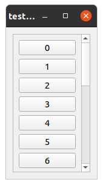

.. _pyqtoverlayer:

=========================
User guide: pyqtoverlayer
=========================

.. _sec-pyqtoverlayer:

Window display
==============
A GUI application must be created before creating a window. This is done by calling the function :func:`.pyqtoverlayer.initialize_gui`, which creates an instance of **QtCore.QApplication**.

In order to create a window filled with a grid layout, use the function :func:`.pyqtoverlayer.create_window`. It outputs two variables: an instance of **QtWidgets.QWidget**, which can be seen as the window container, and an instance of **QtWidgets.QGridLayout**, which can be seen as a board where the different elements of the window are added and aranged. It is mandatory to store the first output of the function (instance of **QtWidgets.QWidget**) in a variable so that the window is displayed.

At the end of the script, there must be an infinite loop so that the window keeps on being displayed until it is closed. This is done by calling the function :func:`.pyqtoverlayer.infinite_loop_gui` which takes the instance of **QtCore.QApplication** as input argument.

The following code gives an example for creating and displaying a window::

	from visiannot.tools import pyqtoverlayer

	app = pyqtoverlayer.initialize_gui()

	# create window and fill it with layout
	win, lay = pyqtoverlayer.create_window(title="test")

	# infinite loop
	pyqtoverlayer.infinite_loop_gui(app)

If several windows are created in a loop, make sure to store the different instances of **QtWidgets.QWidget** in a list. Otherwise the windows won't be displayed. See the example below, where 4 windows are created in a for loop::

	from visiannot.tools import pyqtoverlayer

	app = pyqtoverlayer.initialize_gui()

	# initialize list of windows
	win_list = []

	# loop
	for i in range(4):
	    # create window
	    win, lay = pyqtoverlayer.create_window(title="test %d" % i)

	    # append list of windows
	    win_list.append(win)

	pyqtoverlayer.infinite_loop_gui(app)

Widget creation
===============
Next step is to create widgets and add them to the grid layout. The widgets are the elements in the window. Here is an example::

	from visiannot.tools import pyqtoverlayer

	app = pyqtoverlayer.initialize_gui()

	# create window and fill it with layout
	win, lay = pyqtoverlayer.create_window(title="test", size=(500, 200))

	# first line of widgets
	pyqtoverlayer.add_push_button(lay, (0, 0), "P1")
	pyqtoverlayer.add_check_box(lay, (0, 1), "C1")

	# second line of widgets => same items in a group box
	grid, _ = pyqtoverlayer.add_group_box(lay, (1, 0, 1, 2), "Group box")
	pyqtoverlayer.add_push_button(grid, (0, 0), "P2")
	pyqtoverlayer.add_check_box(grid, (0, 1), "C2", flag_checked=True)

	# group boxes with a list of identical buttons
	pyqtoverlayer.add_widget_button_group(lay, (2, 0, 1, 2), ["R31", "R32", "R33"], box_title="Radio buttons")
	pyqtoverlayer.add_widget_button_group(lay, (3, 0), ["P41", "P42"], button_type="push", flag_horizontal=False)

	# group box with a list of line edits
	pyqtoverlayer.add_line_edit_list(lay, (3, 1), 2, name="Line edits")

	# table of spin boxes
	pyqtoverlayer.add_spin_box_table(lay, (0, 2, 4, 1), 4, 2, name="Spin boxes")

	# group box with a combo box
	pyqtoverlayer.add_combo_box(lay, (4, 0, 1, 3), ["Choice 1", "Choice 2"], box_title='')

	# infinite loop
	pyqtoverlayer.infinite_loop_gui(app)

which renders a window as shown below.

  Example of widgets creation

pyqtoverlayer provides functions for creating six types of objects:

- Push button: :func:`.add_push_button`
- Check box: :func:`.add_check_box`
- Radio button: :func:`.add_radio_button`
- Line edit: :func:`.add_line_edit_list`
- Spin box: :func:`.add_spin_box_table`
- Combo box: :func:`.add_combo_box`

In all these functions, the first two positional arguments are the same: parent layout where to add the widget and position of the widget in the parent layout. The last three functions add a group box to the layout, in which are added the objects. :func:`.add_line_edit_list` and :func:`.add_spin_box_table` allows to add several objects.

The positioning of the widget in the layout is specified by the zero-indexed tuple ``(row, col)``. If the widget spans several rows or severals columns, then the tuple is ``(row, col, rowspan, colspan)``. For example, a widget at position ``(0, 1, 1, 3)`` starts at the first row / second column, and spans 3 columns. A widget at position ``(1, 0, 5, 1)`` starts at second row/first column, and spans 5 rows. A widget at position ``(2, 1, 2, 3)`` starts at third row/second column, and spans 2 rows and 3 columns.

The figure below shows the same window as above with the position of the widgets outlined.

  Example of widgets creation with the position of the widgets in the layout

Let assume that we need to add a line edit without including it in a group box or an object that is not supported here. This is done as follows::

	obj = QtWidgets.QLineEdit()
	pyqtoverlayer.add_widget_to_layout(lay, obj, pos)

where QtWidgets is imported from **PyQt5**, ``lay`` is the grid layout where to add the object and ``pos`` is the tuple with position of the object in the layout. ``QLineEdit`` can be replaced by any other type of object provided by Qt.

Button group
------------
The case of radio button is a bit particular. There is no reason to add a single radio button, since it is normally used for an exclusive choice between several options. So it is more likely that we need to add several radio buttons that are grouped together with exclusivity (i.e. only one radio button can be selected). For this purpose, we can use the function :func:`add_widget_button_group`. By default it adds radio button, but it can be used for push buttons and check boxes as well. Here is an example::

	from visiannot.tools import pyqtoverlayer

	app = pyqtoverlayer.initialize_gui()

	# create window and fill it with layout
	win, lay = pyqtoverlayer.create_window(title="test", size=(400, 150))

	# radio buttons
	grid, _, _ = pyqtoverlayer.add_widget_button_group(lay, (0, 0), ["R1", "R2", "R3", "R4"])

	# push buttons
	pyqtoverlayer.add_widget_button_group(lay, (1, 0), ["P1", "P2", "P3"], button_type="push")

	# check boxes
	pyqtoverlayer.add_widget_button_group(lay, (0, 1, 2, 1), ["C1", "C2"], button_type="check_box", flag_horizontal=False)

	# infinite loop
	pyqtoverlayer.infinite_loop_gui(app)

which renders a window as shown below.

  Example of button groups

The first output of the function (named ``grid`` in the example) is the layout inside the group box containing the buttons. If we need to directly manipulate the button instance (for instance to get the associated text), then we can use the following code: ``grid.itemAtPosition(row, col).widget()``. For example, to get the third radio button: ``radio_button = grid.itemAtPosition(0, 2).widget()`` (first row, third column).

Setting values in a list of line edits
--------------------------------------
It is possible to set the value of a list of line edits directly in a script with the function :func:`.set_line_edit_list`. The list of line edits must be in a group box that contains only these objects (this can be done with the function :func:`.add_line_edit_list`). Here is an example with a list of two line edits taking respectively the value "Value 1" and "Value 2"::

	from visiannot.tools import pyqtoverlayer

	app = pyqtoverlayer.initialize_gui()

	# create window and fill it with layout
	win, lay = pyqtoverlayer.create_window(title="test", size=(400, 150))

	# add list of line edits
	grid, _ = pyqtoverlayer.add_line_edit_list(lay, (0, 0), 2, name="Line edits")

	# set the value of the line edits
	pyqtoverlayer.set_line_edit_list(grid, ["Value 1", "Value 2"], True)

	# infinite loop
	pyqtoverlayer.infinite_loop_gui(app)

The last positional argument of :func:`.set_line_edit_list` is the setting mode. When it is set to ``0``, the line edits take the value specified by the second positional argument. When it is set to ``1``, then the function returns a list with the values written in the line edits.

Setting values in a table of spin boxes
---------------------------------------
It is possible to set the values in a table of spin boxes directly in a script with the function :func:`.set_spin_box_table`. The list of line edits must be in a group box that contains only these objects (this can be done with the function :func:`.add_line_edit_list`). Here is an example::

	from visiannot.tools import pyqtoverlayer

	app = pyqtoverlayer.initialize_gui()

	# create window and fill it with layout
	win, lay = pyqtoverlayer.create_window(title="test", size=(400, 150))

	# add list of line edits
	grid, _ = pyqtoverlayer.add_spin_box_table(lay, (0, 0), 2, 3, name="Spin boxes")

	# set the value of the line edits
	pyqtoverlayer.set_spin_box_table(grid, [[4, 5, 6], [7, 8, 9]], True)

	# infinite loop
	pyqtoverlayer.infinite_loop_gui(app)

which renders the window as shown below.

.. figure:: images/pyqt_ex3.png

  Example of a table of spin boxes with values set

The last positional argument of :func:`.set_spin_box_table` is the setting mode. When it is set to ``0``, the spin boxes take the value specified by the second positional argument. When it is set to ``1``, then the function returns a nested list with the values written in the spin boxes.

Callback management
===================
**pyqtoverlayer** does not provide an overlayer for callback management. The API provided by PyQt for this purpose is quite easy to use with **pyqtoverlayer**.

Example 1
---------
Here is a simple example::

	from visiannot.tools import pyqtoverlayer

	######################
	# Callback functions #
	######################
	def print_text():
	    print("Top button pushed")

	def check_clicked(ev):
	    print(ev.text(), ev.isChecked())

	def radio_clicked(i):
	    print("Radio button n°%d" % (i + 1))

	def combo_index_modif(i):
	    print("Combo box index: %d" % (i + 1))

	def combo_option(text):
	    print(text)

	######################
	# Script starts here #
	######################
	app = pyqtoverlayer.initialize_gui()

	# create window and fill it with layout
	win, lay = pyqtoverlayer.create_window(title="test", size=(300, 180))

	# add push button
	push_button = pyqtoverlayer.add_push_button(lay, (0, 0), "Push me")

	# add list of check boxes
	_, _, group_check = pyqtoverlayer.add_widget_button_group(
		lay, (1, 0), ["C1", "C2", "C3"], button_type="check_box"
	)

	# add list of radio buttons
	_, _, group_radio = pyqtoverlayer.add_widget_button_group(
		lay, (2, 0), ["R1", "R2", "R3"]
	)

	# add combo box
	_, _, combo_box = pyqtoverlayer.add_combo_box(
		lay, (3, 0), ["Option 1", "Option 2"], box_title="Combo box"
	)

	# listen to callbacks
	push_button.clicked.connect(print_text)
	group_check.buttonClicked.connect(check_clicked)
	group_radio.buttonClicked[int].connect(radio_clicked)
	combo_box.currentIndexChanged.connect(combo_index_modif)
	combo_box.currentTextChanged.connect(combo_option)

	# infinite loop
	pyqtoverlayer.infinite_loop_gui(app)

which renders a window as shown below.

  Example for callback management

There are three widgets: one push button, a group of check boxes and a group of radio buttons. These objects emit a signal when they are clicked. We can connect this signal to a slot, i.e. a function that is called every time the signal is emitted.

The push button emits the signal ``clicked`` when it is clicked. It is connected to the function ``print_text`` with the following code: ``push_button.clicked.connect(print_text)``.

The group of check boxes emits the signal ``buttonClicked`` when one check box is clicked. It is connected to the function ``check_clicked`` with the following code: ``group_check.buttonClicked.connect(check_clicked)``. The callback function takes one positional argument: the check box that has been clicked. So, inside this function, we can manipulate the check box that has been clicked. In the example, we print the text associated to the check box and a boolean specifying if the check box is checked.

The group of radio buttons is also a button group, so it emits the same signal ``buttonClicked``. It is connected to the function ``radio_clicked`` with the following code: ``group_radio.buttonClicked[int].connect(radio_clicked)``. This time, we add ``[int]`` so that the positional argument of the callback function is the index of the button that has been clicked (this is generic to button group, so it can be applied to check boxes and push buttons as well).

The combo box emits several signals, among them ``currentIndexChanged`` and ``currentTextChanged`` that are emitted when a new text is selected. First signal is linked to the index of the text in the combo box, second signal is linked to the text in the combo box.

Example 2
---------
We give here a more complex example with two windows: master and slave. The master window allows to control what is displayed in the slave window. The code is based on object-oriented programming and we define a class that encompasses both windows. The advantage of this approach is that we can manipulate all the attributes of the class in the callback methods without having to put them as positional arguments. Here is the code::

	from visiannot.tools import pyqtoverlayer
	from PyQt5.QtWidgets import QLineEdit, QSpinBox
	from PyQt5 import QtCore

	####################
	# Class definition #
	####################
	class WindowCouple():
	    def __init__(self, nb_push_button):
	        # input attribute
	        if nb_push_button > 0:
	            self.nb_push_button = nb_push_button
	        else:
	            self.nb_push_button = 1

	        #################
	        # master window #
	        #################

	        # create window
	        self.win_m, self.lay_m = pyqtoverlayer.create_window(title="Master", size=(500, 250))

	        # add group box with spin box
	        spin_name = "Number of push button"
	        grid_spin, _ = pyqtoverlayer.add_spin_box_table(
	        	self.lay_m, (0, 0), 1, 1, name=spin_name
	        )

	        # get spin box
	        self.spin_box_nb = grid_spin.itemAt(0).widget()

	        # set spin box minimum value
	        self.spin_box_nb.setMinimum(1)

	        # initialize spin box value
	        self.spin_box_nb.setValue(self.nb_push_button)

	        # add line edit
	        self.line_edit = QLineEdit()
	        pyqtoverlayer.add_widget_to_layout(self.lay_m, self.line_edit, (1, 0))

	        # add spin box
	        self.spin_box_id = QSpinBox()
	        pyqtoverlayer.add_widget_to_layout(self.lay_m, self.spin_box_id, (1, 1))

	        # set minimum/maximum value of the spin box
	        self.spin_box_id.setMinimum(1)
	        self.spin_box_id.setMaximum(self.nb_push_button)

	        # add master push button
	        self.push_button = pyqtoverlayer.add_push_button(
	        	self.lay_m, (1, 2), "Set push button"
	        )

	        # add check box
	        self.check_box = pyqtoverlayer.add_check_box(self.lay_m, (2, 0), "Online")

	        ################
	        # slave window #
	        ################

	        # create window
	        self.win_s, self.lay_s = pyqtoverlayer.create_window(
	        	title="Slave", size=(150, 250)
	        )
	        
	        # so that the size of the window does not change
	        # when adding push buttons
	        self.win_s.setFixedSize(150, 250)

	        # initialize list of slave push buttons
	        self.push_button_list = []

	        # add push buttons
	        self.add_push_button()

	        #######################
	        # listen to callbacks #
	        #######################
	        self.win_m.keyPressEvent = self.key_press
	        self.win_s.keyPressEvent = self.key_press
	        self.spin_box_nb.valueChanged.connect(self.set_nb_txt_items)
	        self.line_edit.textEdited.connect(self.edit_text_online)
	        self.push_button.clicked.connect(self.edit_text_offline)

	    ####################
	    # callback methods #
	    ####################

	    def key_press(self, ev):
	        keyboard_modifiers = ev.modifiers()

	        # get pressed key
	        key = ev.key()

	        if key == QtCore.Qt.Key_Escape:
	            self.win_m.close()
	            self.win_s.close()

	        elif key == QtCore.Qt.Key_R:
	            if keyboard_modifiers == QtCore.Qt.ControlModifier:
	                self.setNbTxtItems(1)
	                self.spin_box_nb.setValue(1)

	    def set_nb_txt_items(self, i):
	        self.nb_push_button = i

	        # update maximum value of spin box with button ID
	        self.spin_box_id.setMaximum(self.nb_push_button)

	        # check if push buttons to be added or removed
	        if self.nb_push_button > len(self.push_button_list):
	            self.add_push_button()
	        elif self.nb_push_button < len(self.push_button_list):
	            self.removePushButton()

	    def edit_text_online(self, text):
	        # check if online mode enabled
	        if self.check_box.isChecked():
	            # get ID of the push button to edit
	            button_id = self.spin_box_id.value() - 1

	            # set text of the push button
	            self.push_button_list[button_id].setText(text)

	    def edit_text_offline(self):
	        # get ID of the push button to edit
	        button_id = self.spin_box_id.value() - 1

	        # get text
	        text = self.line_edit.text()

	        # set text of the push button
	        self.push_button_list[button_id].setText(text)

	    ############################
	    # methods for slave window #
	    ############################

	    def add_push_button(self):
        	# get number of push buttons already created
        	nb_push_button = len(self.push_button_list)

        	# loop on push buttons to create
        	for i in range(nb_push_button, self.nb_push_button):
        	    # get default text
	            default_text = "Default %d" % (i + 1)

	            # add push button
	            push_button = pyqtoverlayer.add_push_button(self.lay_s, (i, 0), default_text)

	            # append list
	            self.push_button_list.append(push_button)

	    def remove_push_button(self):
	        # get number of push buttons already created
	        nb_push_button = len(self.push_button_list)

	        # get number of push buttons to remove
	        nb_to_remove = nb_push_button - self.nb_push_button

	        # remove push buttons
	        pyqtoverlayer.delete_widgets_from_layout(self.lay_s, nb_to_remove)
	        for i in range(nb_to_remove):
	            self.push_button_list.pop()

	######################
	# Script starts here #
	######################
	app = pyqtoverlayer.initialize_gui()
	w = WindowCouple(2)
	pyqtoverlayer.infinite_loop_gui(app)

which renders the windows as shown below.

  Example for callback management

In the master window, the user can choose how many push buttons are displayed in the slave window with the first spin box. In the example, this value is initialized to 2. Then, to modify the text displayed in a slave push button, the user enters the text in the line edit, specifies which slave push button to modify with the spin box and validate with the master push button "Set push button". When the check box "Online" is checked, then the slave push button is modified online while the line edit is edited. The user can close both windows at once with the escape key and reset the number of slave push buttons to 1 with both control and R key pressed.

In the constructor, we first create the master and slave windows and add widgets to them. Then we listen to the callbacks::

    self.win_m.keyPressEvent = self.key_press
    self.win_s.keyPressEvent = self.key_press
    self.spin_box_nb.valueChanged.connect(self.set_nb_txt_items)
    self.line_edit.textEdited.connect(self.edit_text_online)
    self.push_button.clicked.connect(self.edit_text_offline)

The first two lines are for the key_press interaction. The syntax is different in this case: ``win.keyPressEvent = key_press`` where ``win`` is the instance of **QtWidgets.QWidget** containing the window and ``key_press`` is the callback method. We must listen to the callback on both windows so that the key press interaction works regardless of the current window. The callback function takes as positional argument the instance of **QtGui.QKeyEvent** emitted when a key is pressed. We retrieve the modifier key with ``keyboard_modifiers = ev.modifiers()`` and the pressed key with ``key = ev.key()``. First, we check if the pressed key is escape. In this case both windows are closed. Second, we check if the pressed key is R and and if the modifier key is control (this means that both R and control keys are pressed). Then, we reset the number of slave push buttons to 1.

``self.spin_box_nb.valueChanged.connect(self.set_nb_txt_items)``: in order to change the number of slave push buttons, we listen to the signal ``valueChanged`` emitted by ``self.spin_box_nb`` and we connect it to the callback method ``set_nb_txt_items``. It takes as positional arguments the value in the spin box (i.e. the new number of slave push buttons).

``self.line_edit.textEdited.connect(self.edit_text_online)``: we listen to the signal ``textEdited`` emitted when the line edit is edited and we connect it to the callback method ``edit_text_online``. It takes as positional argument the content of the line edit. In the callback method, we first check if the online mode is enabled, i.e. if the check box is checked. Then we get the index of the slave push button to modify, i.e. the value of the spin box. Lastly, we modify the text of the corresponding slave push button.

``self.push_button.clicked.connect(self.edit_text_offline)``: we listen to the signal ``clicked`` emitted when the master push button is clicked and connect it to the callback method ``edit_text_offline``. In the callback method, we first get the index of the slave push button to modify, i.e. the value of the spin box. Then we get the content of the line edit. Lastly, we modify the text of the corresponding slave push button.

If we add more than 12 slave push buttons, we observe that they start to be unreadable. This is because we forced the window to have a fixed size and the push buttons must fit in. In the next section, we show how to add a scroll area so that the widgets can span more width/height than the window size.

Scroll area
===========
If we need to add a lot of widgets in a window, we may exceed the window size and get an unreadable layout. In this case, the scroll area is the solution. Here is an example::

	from visiannot.tools import pyqtoverlayer

	# number of buttons in the window
	nb_buttons = 20

	app = pyqtoverlayer.initialize_gui()

	# create window
	win, lay = pyqtoverlayer.create_window(size=(150, 250))

	# add scroll area
	scroll_lay, _ = pyqtoverlayer.add_scroll_area(lay, (0, 0))

	# loop on buttons
	for i in range(nb_buttons):
	    # add push button
	    push_button = pyqtoverlayer.add_push_button(lay, (i, 0), "%d" % i)

	    # add push button to the scroll area
	    scroll_lay.addWidget(push_button)

	pyqtoverlayer.infinite_loop_gui(app)

which renders the window as shown below.

  Example of scroll area

``scroll_lay, _ = pyqtoverlayer.add_scroll_area(lay, (0, 0, nb_buttons, 1))``: when we create the scroll area, we need to specify the position range of the widgets that must be included in it. In the example, the first widget is at position ``(0, 0)`` and all the widgets span ``nb_buttons`` rows and one column.

``scroll_lay.addWidget(push_button)``: when we add a widget to the layout, we must also add it to the scroll layout.
