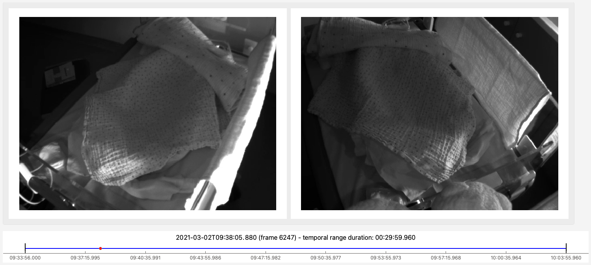
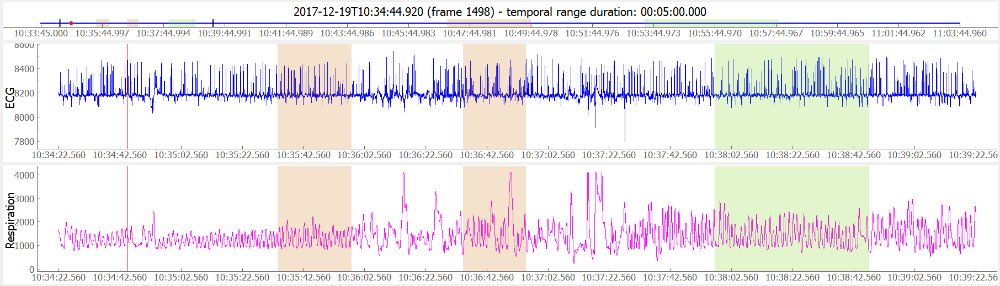
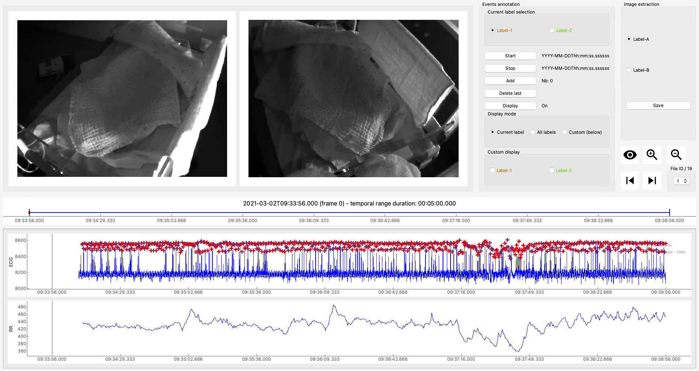

.. _userguide-visiannot:

=====================
User guide: ViSiAnnoT
=====================

**ViSiAnnoT** has been designed to be as easy to use as possible, while being highly configurable so that it could meet a variety of needs. In this section, we introduce the different features of **ViSiAnnoT** and we illustrate them with examples.

.. _video:

Video visualization with multiple cameras
=========================================
**ViSiAnnoT** can be used as a simple video player. Supported formats are the ones that are supported by **OpenCV** (for instance mp4 and avi). It is possible to play as many videos as wanted simultaneously, provided that they are synchronized. This is useful when the user has video files of several synchronized cameras. The name of the video files must contain the beginning datetime of the video, so that the software can check if the videos are indeed synchronized (a shift of one second is authorized between the video files).

Here is an example::

	from visiannot.visiannot import ViSiAnnoT

	# video paths
	path_video_1 = "data/2017-12-19T11-33-46_color.mp4"
	path_video_2 = "data/2017-12-19T11-33-46_BW1.mp4"
	path_video_3 = "data/2017-12-19T11-33-46_BW2.mp4"

	# video configuration
	video_dict = {}
	video_dict["color"] = (path_video_1, '_', 0, "%Y-%m-%dT%H-%M-%S")
	video_dict["BW1"] = (path_video_2, '_', 0, "%Y-%m-%dT%H-%M-%S")
	video_dict["BW2"] = (path_video_3, '_', 0, "%Y-%m-%dT%H-%M-%S")

	# create ViSiAnnoT window
	win_visiannot = ViSiAnnoT(video_dict, {})

From the sub-package **visiannot** we import the class :class:`.ViSiAnnoT`. We have a set of 3 synchronized videos (one in color and two in black & white), located in the folder *data*. The configuration dictionary ``video_dict`` specifies to :class:`.ViSiAnnoT` where to find the videos and how to get the beginning datetime in the video file name. Each item corresponds to one camera, the key is the camera ID and the value is a list/tuple of 4 elements:

* Path to the video file,
* Delimiter to get the beginning datetime in the video file name,
* Position of the beginning datetime in the video file name, according to the delimiter,
* Format of the beginning datetime in the video file name (``"posix"`` or format compliant with ``datetime``, see https://docs.python.org/3/library/datetime.html#strftime-and-strptime-format-codes).

The instance of :class:`.ViSiAnnoT` must be stored in a variable in order to have the window displayed.

:numref:`fig-example-video` shows a screenshot of the resulting window. At the bottom, there is the progress bar which gives the current temporal position with the red dot and allows to navigate in the video. We call the red dot "navigation point". The temporal axis is expressed in absolute time. It is possible to navigate in the video by clicking in the progress bar and dragging the navigation point. The user can start/stop the video playback with the space key.

.. _fig-example-video:

  Screenshot of ViSiAnnoT used as a video player

If audio is contained in the video file, there is currently no audio playback.

.. _signal:

Signal visualization
====================
**ViSiAnnoT** can be used as a simple signal viewer. The user can define as many widgets as wanted (which can be seen as figures) and plot as many signals as wanted in a widget. As for video visualization, the signal files should be synchronized.

Signal format
-------------
Supported formats are txt, mat, h5 and wav. There are two ways to store the signal:

* As a vector of length :math:`n_{sample}`, where :math:`n_{sample} \in \mathbb{N}` is the number of samples in the file. In this case, the frequency is constant and must be provided by the user.
* As a matrix of shape :math:`(n_{sample},2)`, where the first column contains the timestamp of each sample and the second column contains the value of the samples. This is particularly useful for non regularly sampled signals. The timestamps are expressed in milliseconds relatively to the beginning datetime of the file.

In case several signals are plotted, the fact that their frequencies may be different is automatically managed.

An example of non regularly sampled signal is the RR series, which is extracted from the physiological signal ECG (electrocardiogram). The ECG measures the electrical activity of the heart beat. During a heart beat cycle, there is a peak that can be detected. The RR series is defined as the difference between two successive peaks in the ECG. Since these peaks are not regular, the RR series is non regularly sampled.

.. _signal_ex:

Multiple signals on the same plot
---------------------------------
**ViSiAnnoT** allows to display as many signals as wanted on the same plot. A default plot style can be used for up to 10 signals on the same plot. Since plotting relies on `Pyqtgraph`_, all the configurations available in this package can be used to customize plot style (see keyword arguments of `PlotDataItem`_ constructor).

.. _Pyqtgraph: http://pyqtgraph.org/
.. _plotdataitem: https://pyqtgraph.readthedocs.io/en/latest/graphicsItems/plotdataitem.html#pyqtgraph.PlotDataItem.__init__

Here is an example::

	from visiannot.visiannot import ViSiAnnoT

	# signal paths
	path_ecg = "data/20170423T002840_ecg.txt"
	path_resp = "data/20170423T002840_resp.txt"
	path_tqrs = "data/20170423T002840_tqrs.mat"

	# define plot style
	plot_style_tqrs = {
	    'pen': None,
	    'symbol': '+',
	    'symbolPen': 'r',
	    'symbolSize': 10
	}

	plot_style_resp = {'pen': {'color': 'm', 'width': 1}}

	# signal configuration
	signal_dict = {}

	signal_dict["ECG"] = [
	    [path_ecg, "ecg", 500, '_', 0, "%Y%m%dT%H%M%S", None],
	    [path_tqrs, "tqrs", 0, '_', 0, "%Y%m%dT%H%M%S", plot_style_tqrs]
	]

	signal_dict["Respiration"] = [
	    [path_resp, "", 62.5, '_', 0, "%Y%m%dT%H%M%S", plot_style_resp]
	]

	# create ViSiAnnoT window
	win_visiannot = ViSiAnnoT(
	    {}, signal_dict, flag_pause_status=True, layout_mode=2
	)

From the sub-package **visiannot** we import the class :class:`.ViSiAnnoT`. We have a set of 3 synchronized signals (ECG, respiration and QRS beat detection), located in the folder *data*. The configuration dictionary ``signal_dict`` specifies to :class:`.ViSiAnnoT` where to find the signal files, what is the frequency of the signals, how to get the beginning datetime of the signal file and how to plot. Each item corresponds to one signal widget. The key is the widget ID, which is used as Y axis label. The value is a nested configuration list where each element corresponds to one signal to plot and is a list of 7 elements:

* Path to the signal file,
* Key to access the data in the file (in case of .h5 or .mat, set it to ``''`` otherwise), also used a legend,
* Signal frequency (may also be a string with path to the frequency attribute in case of h5 file), set it to ``0`` in case of non-regularly sampled signal,
* Delimiter to get the beginning datetime in the signal file name,
* Position of the beginning datetime in the signal file name, according to the delimiter,
* Format of the beginning datetime in the signal file name (``"posix"`` or format compliant with ``datetime``, see https://docs.python.org/3/library/datetime.html#strftime-and-strptime-format-codes),
* Dictionary with plot style.

The keyword argument ``pause_status`` is set to True so that the video playback is disabled at launch. The instance of :class:`.ViSiAnnoT` must be stored in a variable in order to have the window displayed.

:numref:`fig-example-signal` shows a screenshot of the resulting window. On the first plot, there are two signals: ECG (sampled at 500 Hz) and QRS beat detection (non regularly sampled). On the second plot, there is one signal: respiration. The default plot style is used for the ECG (blue curve), whereas a custom plot style is defined for QRS beat detection (red dots) and respiration (purple curve). We call "temporal cursor" the red vertical line on the signal plots giving the current temporal position. It is linked to the red dot in the progress bar, which is above the signal plots.

.. _fig-example-signal:

  Screenshot of ViSiAnnoT used as a signal viewer

Audio signal visualization
--------------------------
Regarding the visualization of an audio signal, the configuration is slightly different since the user must provide the channel to display (left or right). Here is an example::

	from visiannot.visiannot import ViSiAnnoT

	# audio path
	path_audio = "data/Zef.wav"

	# signal configuration
	signal_dict = {}

	signal_dict["Audio L"] = [[path_audio, "Left channel", 0, '', None, '', None]]
	signal_dict["Audio R"] = [[path_audio, "Right channel", 0, '', None, '', None]]

	# create ViSiAnnoT window
	win_visiannot = ViSiAnnoT(
	    {}, signal_dict, flag_pause_status=True, layout_mode=2
	)

We define two signal widgets: "Audio L" and "Audio R". They both take the same audio file as input.

In order to specify the channel to display in each plot, we use the key to access data and set it to "Left channel" and "Right channel". The key word for channel selection is "left" or "right", regardless of the letter capitalization and the position in the string. If no channel is specified, then the left channel is displayed by default.

The signal frequency is automatically retrieved from the wav file, so in the configuration list it can be set to anything (in this example ``0``).

The beginning datetime is not contained in the audio file name, so one of the three related variables is set to ``None`` and a default datetime is defined (2000/01/01 at 00:00:00).

:numref:`fig-example-audio` shows a screenshot of the resulting window.

.. _fig-example-audio:

  Screenshot of ViSiAnnoT used as an audio signal viewer

Zoom tools
----------
The default zoom of PyQtGraph is available for the Y axis of the signal plots and is overwritten for the X axis so that all the signal plots are linked. Thus the zoom tools described here only affects the temporal axis.

Based on :numref:`fig-example-signal`, :numref:`fig-example-signal-zoom` illustrates the temporal zoom. We call "temporal range" the period of the signals that is displayed and "temporal range duration" its duration. In the progress bar, the black lines delimit the temporal range. We can see that the temporal range duration in :numref:`fig-example-signal` is 00h30min00s and becomes 00h00min21s after zoom in :numref:`fig-example-signal-zoom`. The black lines of the progress bar have also moved to show what part of the signals is displayed.

.. _fig-example-signal-zoom:

.. figure:: images/example_signal_zoom.png

  Screenshot of ViSiAnnoT used as a signal viewer after zoom

The user can zoom in/out around the temporal cursor by using the two buttons looking like magnifying glass. It is also possible to directly zoom out in order to visualize the full signals by using the button looking like an eye. The buttons can be seen in the top left corner of the window.

The temporal range can be defined with the combo list "Temporal range duration". The user can select the duration of the new temporal range which starts at the current position of the temporal cursor.

.. _yrange:

YRange
------
The range of values on the Y axis of a specific signal widget may be fixed by the user. This is done with the dictionary ``y_range_dict`` which is passed to :class:`.ViSiAnnoT`. The key of the dictionary must correspond to a key of ``signal_dict``, it specifies the signal widget where the Y range is fixed. The value of the dictionary is a tuple of length 2 with the minimum and maximum value on the Y axis.

Here is an example::

	from visiannot.visiannot import ViSiAnnoT

	# signal paths
	path_ecg = "data/20170423T002840_ecg.txt"
	path_tqrs = "data/20170423T002840_tqrs.mat"

	# define plot style
	plot_style_tqrs = {
	    'pen': None,
	    'symbol': '+',
	    'symbolPen': 'r',
	    'symbolSize': 10
	}

	plot_style_resp = {'pen': {'color': 'm', 'width': 1}}

	# signal configuration
	signal_dict = {}

	signal_dict["ECG"] = [
	    [path_ecg, "ecg", 500, '_', 0, "%Y%m%dT%H%M%S", None],
	    [path_tqrs, "tqrs", 0, '_', 0, "%Y%m%dT%H%M%S", plot_style_tqrs]
	]

	# YRange configuration
	y_range_dict = {}
	y_range_dict["ECG"] = (500, 1000)

	# create ViSiAnnoT window
	win_visiannot = ViSiAnnoT(
	    {}, signal_dict, y_range_dict=y_range_dict, flag_pause_status=True
	)

.. _threshold:

Threshold values
----------------
Threshold values can be drawn as horizontal lines on a signal plot. It may be useful to identify temporal intervals where a signal is above or below a specific value.

Here is an example::

	from visiannot.visiannot import ViSiAnnoT

	# signal paths
	path_ecg = "data/20170423T002840_ecg.txt"
	path_tqrs = "data/20170423T002840_tqrs.mat"

	# define plot style
	plot_style_tqrs = {
		'pen': None,
		'symbol': '+',
		'symbolPen': 'r',
		'symbolSize': 10
	}

	# signal configuration
	signal_dict = {}

	signal_dict["ECG"] = [
		[path_ecg, "ecg", 500, '_', 0, "%Y%m%dT%H%M%S", None],
		[path_tqrs, "tqrs", 0, '_', 0, "%Y%m%dT%H%M%S", plot_style_tqrs]
	]

	signal_dict["RR"] = [[path_tqrs, "rr", 0, '_', 0, "%Y%m%dT%H%M%S", None]]

	# threshold configuration
	threshold_dict = {}
	threshold_dict["RR"] = [
		[600, "#336600"],
		[750, "#B22222"]
	]

	# create ViSiAnnoT window
	win_visiannot = ViSiAnnoT(
		{}, signal_dict, flag_pause_status=True, layout_mode=2,
		threshold_dict=threshold_dict
	)

From the sub-package **visiannot** we import the class :class:`.ViSiAnnoT`. We have a set of 3 synchronized signals (ECG, QRS beat detection and RR series), located in the folder *data*. The QRS beat detection and RR series are stored in the same mat file, it is specified in ``signal_dict`` what is their respective key to access them (``"tqrs"`` and ``"rr"``). Both of those signals are non regularly sampled, so it is compulsory to set a regularly sampled signal on top (here ``"ecg"``).

The threshold configuration dictionary ``threshold_dict`` specifies on which signal widget to draw the threshold (keys of the dictionary), the threshold value and its color (values of the dictionary). In this example, two thresholds are defined on the ``"RR"`` plot. :numref:`fig-example-threshold` shows this particular plot.

.. _fig-example-threshold:

.. figure:: images/example_thresholds.png

  Detail of a screenshot of ViSiAnnoT used as a signal viewer with two thresholds

.. _intervals:

Temporal intervals
------------------
It is also possible to display temporal intervals on the signal plots. This may be useful if the user has pre-annotations or results from a detection algorithm and wants to visually check their accuracy.

Here is an example::

	from visiannot.visiannot import ViSiAnnoT

	# signal paths
	path_ecg = "data/20170423T002840_ecg.txt"
	path_tqrs = "data/20170423T002840_tqrs.mat"
	path_interval = "data/20170423T002840_interval.txt"
	path_intervalbis = "data/20170423T002840_intervalbis.txt"

	# define plot style
	plot_style_tqrs = {
		'pen': None,
		'symbol': '+',
		'symbolPen': 'r',
		'symbolSize': 10
	}

	# signal configuration
	signal_dict = {}
	signal_dict["ECG"] = [
		[path_ecg, "ecg", 500, '_', 0, "%Y%m%dT%H%M%S", None],
		[path_tqrs, "tqrs", 0, '_', 0, "%Y%m%dT%H%M%S", plot_style_tqrs]
	]

	# interval configuration
	interval_dict = {}
	interval_dict["ECG"] = [
		[path_interval, "", 500, '_', 0, "%Y%m%dT%H%M%S", (0, 255, 0, 50)],
		[path_intervalbis, "", 500, '_', 0, "%Y%m%dT%H%M%S", (255, 200, 0, 50)]
	]

	# create ViSiAnnoT window
	win_visiannot = ViSiAnnoT(
		{}, signal_dict, flag_pause_status=True, layout_mode=2,
		interval_dict=interval_dict
	)

From the sub-package **visiannot** we import the class :class:`.ViSiAnnoT`. We have a set of 2 synchronized signals (ECG and QRS beat detection) and 2 synchronized intervals, located in the folder *data*. The intervals may be stored in two ways in the files:

* As a vector of length :math:`n_{sample}` with 0 and 1, where :math:`n_{sample} \in \mathbb{N}` is the number of samples in the file,
* As a matrix of shape :math:`(n_{inter},2)`, where :math:`n_{inter} \in \mathbb{N}` is the number of intervals in the file, each line is an interval with the starting sample and the ending sample.

The configuration dictionary ``interval_dict`` specifies to :class:`.ViSiAnnoT` where to find the interval file, what is the frequency of the interval, how to get the beginning datetime of the interval file and how to plot. Each item corresponds to one signal widget. The key is the widget ID (same as in ``signal_dict``). The value is a nested configuration list where each element corresponds to one type of interval and is a list of 7 elements:

* Path to the interval file,
* Key to access the data in the file (in case of .h5 or .mat, set it to ``''`` otherwise),
* Interval frequency (may also be a string with path to the frequency attribute in case of h5 file),
* Delimiter to get the beginning datetime in the interval file name,
* Position of the beginning datetime in the interval file name, according to the delimiter,
* Format of the beginning datetime in the interval file name (``"posix"`` or format compliant with ``datetime``, see https://docs.python.org/3/library/datetime.html#strftime-and-strptime-format-codes),
* RGB color.

In this example, two types of intervals are defined on the ``"ECG"`` plot. A specific color is assigned to each type of temporal intervals. :numref:`fig-example-intervals` shows this particular plot.

.. _fig-example-intervals:

  Detail of a screenshot of ViSiAnnoT used as a signal viewer with additional temporal intervals

Combined video and signal visualization
=======================================
**ViSiAnnoT** allows to combine video and signal visualization. The videos and the signals must be synchronized. If they do not share the same frequency, it is automatically taken into account.

Here is an example::

	from visiannot.VISIANNOT import ViSiAnnoT

	# video paths
	path_video_1 = "data/2017-12-19T11-33-46_color.mp4"
	path_video_2 = "data/2017-12-19T11-33-46_BW1.mp4"
	path_video_3 = "data/2017-12-19T11-33-46_BW2.mp4"

	# video configuration
	video_dict = {}
	video_dict["color"] = (path_video_1, '_', 0, "%Y-%m-%dT%H-%M-%S")
	video_dict["BW1"] = (path_video_2, '_', 0, "%Y-%m-%dT%H-%M-%S")
	video_dict["BW2"] = (path_video_3, '_', 0, "%Y-%m-%dT%H-%M-%S")

	# signal paths
	path_ecg = "data/20170423T002840_ecg.txt"
	path_tqrs = "data/20170423T002840_tqrs.mat"

	# define plot style
	plot_style_tqrs = {
	    'pen': None,
	    'symbol': '+',
	    'symbolPen': 'r',
	    'symbolSize': 10
	}

	# signal configuration
	signal_dict = {}

	signal_dict["ECG"] = [
	    [path_ecg, "ecg", 500, '_', 0, "%Y%m%dT%H%M%S", None],
	    [path_tqrs, "tqrs", 0, '_', 0, "%Y%m%dT%H%M%S", plot_style_tqrs]
	]

	# create ViSiAnnoT window
	win_visiannot = ViSiAnnoT(video_dict, signal_dict)

:numref:`fig-example-combined` shows the resulting window. The temporal cursor is linked to the current video frame that is displayed. The user can navigate by clicking on a signal plot in order to change the position of the temporal cursor, then the video is displayed at the same position, as well as the navigation point in the progress bar. It is also possible to navigate by dragging the navigation point in the progress bar.

.. _fig-example-combined:

  Screenshot of ViSiAnnoT used as a combined video and signal visualizer

.. _sec-fast-nav:

Tools for fast navigation
=========================
First, the user can set a truncation duration in order to split by default the display of the signals in several parts. For example, if the signal files last 30 minutes and the user chooses a 10 minutes truncation duration, then there is a combo box which allows to switch from a 10 minutes part to another (0 to 10 minutes , 10 to 20 minutes, 20 to 30 minutes). This feature is set by the keyword argument ``trunc_duration`` in :class:`.ViSiAnnoT` constructor. In the given example: ``trunc_duration=(10, 0)`` (tuple with minutes and seconds of the truncation duration).

Second, there is a combo box to select a temporal range duration in order to display a new temporal range that will begin at the current position of the temporal cursor. The list of available temporal range durations must be configured by the user with the keyword argument ``from_cursor_list`` in :class:`.ViSiAnnoT` constructor. For example, to have the choice between 30 seconds, 1 minute and 1 minute 30 seconds: ``from_cursor_list=[(0, 30), (1, 0), (1, 30)]``.

Third, there is a tool for defining a custom temporal range, as shown in :numref:`fig-example-custom-interval`. The user must define the start datetime of the temporal range. The push button "Current" can be used to define it as the current position of the temporal cursor. Then, the user must define the temporal range duration.

.. _fig-example-custom-interval:

.. figure:: images/custom_interval.png

  Tool for defining a custom temporal range

.. _sec-longrec:

Management of long recording
============================
This section introduces the features for managing long recordings. All features introduced above are still available for long recordings. The class :class:`.ViSiAnnoTLongRec` inherits from :class:`.ViSiAnnoT` and adds specific features to manage long recordings.

A long recording is defined as a set of consecutive video and/or signal files. For example, a long recording lasting for two hours might be composed of four 30-minute length video files and eight 15-minute length signal files.

In this context, there are two additional buttons that allow to switch easily from one file to another and a combo box to directly select a specific file in the recording (with respect to the video files, or the first signal if no video). :numref:`fig-file-selection` shows these buttons and the combo box.

.. _fig-file-selection:

  Buttons and combo box for file selection in a long recording

Set of synchronized files
-------------------------
In this case, the different modalities are synchronized. In the constructor of :class:`.ViSiAnnoTLongRec`, the keyword argument ``flag_synchro`` is set to ``True`` (default value).

For example, let us consider a recording which begins at 00h00min0s on the 2018/01/01 and lasts 90 minutes with video and ECG signal. For each modality, the recording is split in 3 files of 30 minutes. The name of the files would be similar to the following:

* video_2018-01-01T00-00-00.avi, ECG_2018-01-01T00-00-00.h5
* video_2018-01-01T00-30-00.avi, ECG_2018-01-01T00-30-00.h5
* video_2018-01-01T01-00-00.avi, ECG_2018-01-01T01-00-00.h5

At launch, **ViSiAnnoT** loads and display the files "video_2018-01-01T00-00-00.avi" and "ECG_2018-01-01T00-00-00.h5". When clicking on the "next file" button, the files "video_2018-01-01T00-30-00.avi" and "ECG_2018-01-01T00-30-00.h5" are loaded.

Set of asynchronous files
-------------------------
In the case where the different modalities are not synchronized with each other, :class:`.ViSiAnnoTLongRec` automatically synchronize them before display. The keyword argument ``flag_synchro`` of the constructor must be set to ``False``.

We assume that the beginning datetime of each file is contained in its name.

The reference modality for synchronization is the video if there is any, otherwise it is the first signal to plot. Then, when loading a file of the reference modality, **ViSiAnnoT** loads the parts of the other signals that are covered by the reference file.

Here is an example::

	from visiannot.visiannot import ViSiAnnoTLongRec

	# video directory
	dir_video = "data"

	# video configuration
	video_dict = {}
	video_dict["BW1"] = [dir_video, "*BW1*.mp4", '_', 0, "%Y-%m-%dT%H-%M-%S"]
	video_dict["BW2"] = [dir_video, "*BW2*.mp4", '_', 0, "%Y-%m-%dT%H-%M-%S"]

	# signal directory
	dir_sig = "data"

	# signal configuration
	signal_dict = {}

	signal_dict["ECG"] = [
	    [
	        dir_sig, "SynapseRPi/ecg/value", 500, "data_15*.h5", '_', 1, "posix",
	        None
	    ]
	]

	signal_dict["Respiration"] = [
	    [
	        dir_sig, "SynapseRPi/resp/value", 62.5, "data_15*.h5", '_', 1, "posix",
	        {'pen': {'color': 'm', 'width': 1}}
	    ]
	]

	# create ViSiAnnoT window
	win_visiannot = ViSiAnnoTLongRec(
	    video_dict, signal_dict,
	    flag_pause_status=True,
	    flag_synchro=False
	)

From the sub-package **visiannot** we import the class :class:`.ViSiAnnoTLongRec`. For a set of asynchronous files, the keyword argument ``flag_synchro`` is set to ``False`` whereas for a set of synchronized files it is set to ``True``.

We define the video configuration and the signal configuration almost the same way as for the class :class:`.ViSiAnnoT`, but instead of specifying the path to a file, we specify the directory containing the files and a pattern to find them.

Regarding ``video_dict``, each item corresponds to one camera. The key is the camera ID and the value is a list of 5 elements:

* Directory where to find the video files,
* Pattern to find the video files,
* Delimiter to get the beginning datetime in the video file name,
* Position of the beginning datetime in the video file name, according to the delimiter,
* Format of the beginning datetime in the video file name (``"posix"`` or format compliant with ``datetime``, see https://docs.python.org/3/library/datetime.html#strftime-and-strptime-format-codes).

Regarding ``signal_dict``, each item corresponds to one signal widget. The key is the widget ID. The value is a nested configuration list where each element corresponds to one signal to plot and is a list of 8 elements:

* Directory where to find the signal files,
* Key to access the data in the file (in case of .h5 or .mat, set it to ``''`` otherwise), also used a legend,
* Signal frequency (may also be a string with path to the frequency attribute in case of h5 file), set it to ``0`` in case of non-regularly sampled signal,
* Pattern to find the signal files,
* Delimiter to get the beginning datetime in the signal file name,
* Position of the beginning datetime in the signal file name, according to the delimiter,
* Format of the beginning datetime in the signal file name (``"posix"`` or format compliant with ``datetime``, see https://docs.python.org/3/library/datetime.html#strftime-and-strptime-format-codes),
* Dictionary with plot style.

Multi-label annotation tools
============================
**ViSiAnnoT** provides two annotation tools:

* Temporal events annotation,
* Image extraction.

.. _eventsannot:

Events annotation tool
----------------------
This tool allows to annotate temporal intervals. The user can provide as much labels as desired. This tool is useful for establishing the ground truth of a temporal segmentation or classification, as well as studying the occurrence and duration of specific events. It automatically creates a file for each label, where the annotations are written.

When creating an instance of :class:`.ViSiAnnoT` or :class:`.ViSiAnnoTLongRec`, the configuration dictionary of the annotation tool is given to the keyword argument ``annotevent_dict`` of the constructor. Here is an example::

	annotevent_dict = {}
	annotevent_dict["Label-1"] = [200, 105, 0, 50]
	annotevent_dict["Label-2"] = [105, 205, 0, 50]

There are two labels (dictionary keys), to which is associated a color (dictionary values). It is worth to note that the label ``"DURATION"`` is not permitted because it is used internally by :class:`.ViSiAnnoT`.

:numref:`fig-annot-event` shows a screenshot of the events annotation tool.

.. _fig-annot-event:

  Events annotation tool

The radio buttons on the top allow to select the current label. The push buttons "Start" and "Stop" respectively set the beginning and ending datetime of the annotated temporal interval. In this example, the ending datetime is not defined yet. The push button "Add" validates the annotation and appends it in a file. The number of annotations is displayed next to it. The push button "Delete last" deletes the last added annotation. The push button "Display" enables or disables the display of the annotations on the signals plots.

The "Display mode" radio buttons allow to choose what to display:

* "Current label": only the annotations of the current label is displayed (current label is the one selected in the "Current label selection" box),
* "All labels": the annotations of all labels are displayed,
* "Custom (below)": the user can choose the labels to display thanks to the check boxes below.

:numref:`fig-example-annotation` shows a screenshot of two signal plots with annotations displayed. They are displayed similarly to the additional temporal intervals. Each color corresponds to one label. As it can be seen on the progress bar, the temporal range is the first 5 minutes. The annotations outside of the temporal range are still displayed on the progress bar.

.. _fig-example-annotation:

  Detail of a screenshot of ViSiAnnoT with annotations displayed, each color corresponding to one label

It is possible to display the duration of the annotated intervals by clicking with the left button of the mouse while pressing the alt key. The label of the annotated interval must be the current label in order to get the display. An example is given in :numref:`fig-annot-event-desc`.

.. _fig-annot-event-desc:

  Detail of a screenshot of ViSiAnnoT with annotations displayed, two of them with duration displayed

By default, it is not possible to overlap two annotations with the same label. In order to enable this feature, the keyword argument ``flag_annot_overlap`` of :class:`.ViSiAnnoT` constructor must be set to ``True``.

Storage of events annotation
^^^^^^^^^^^^^^^^^^^^^^^^^^^^
In the constructor of :class:`.ViSiAnnoT`, the keyword argument ``annot_dir`` specifies the directory where to store annotation files. By default it is the directory "*Annotations*", located at the current working directory from where **ViSiAnnoT** is launched.

For each label, two text files are created with the intervals of the annotated events. They both have the same content but formatted in a different way: ``datetime`` and ``frame``. The name of the annotation file is respectively ``BASENAME_LABEL-datetime`` and ``BASENAME_LABEL-frame``, where ``BASENAME`` is the basename of the annotation directory and ``LABEL`` is the label.

Each line in an annotation file corresponds to an annotated event: ``TS1 - TS2``, where ``TS1`` (resp. ``TS2``) is the start (resp. stop) timestamp of the annotated event.

The timestamp is formatted as follows in the ``datetime`` file: ``%Y-%m-%dT%H:%M:%S.%sss``, where ``%Y`` is the year in 4 digits, ``%m`` is the month in 2 digits, ``%d`` is the day in 2 digits, ``%H`` is the hour, ``%M`` is the minute, ``%S`` is the second and ``%sss`` is the millisecond.

The timestamp is formatted as follows in the ``frame`` format: ``fileID_sampleID``, where ``fileID`` is the index of the reference file in the long recording (zero-indexed, always ``0`` if **ViSiAnnoT** not launched for a long recording) and ``sampleID`` is the sample index in the reference file. In case of long recording, the reference file corresponds is the file of the first camera if there is any video, otherwise it is the file of the first signal. The sample index is expressed with the video frequency if there is any video, otherwise the frequency of the first signal.

For a given label, the annotation files are located at ``"Annotations/%s_annotations/%s_label-datetime.txt"`` and ``"Annotations/%s_annotations/%s_label-frame.txt"``, where ``%s`` is the name of the (first) file of the first modality (see above).

.. _image-extraction:

Image extraction tool
---------------------
This tool allows to extract a still image from the video(s) and associate a label to it.

When creating an instance of *ViSiAnnoT* or *ViSiAnnoTLongRec*, the configuration of the annotation tool is given to the keyword argument ``annotimage_list``. Here is an example::
	
	annotimage_list = ["Label-A", "Label-B", "Label-C"]

:numref:`fig-annot-im` shows a screenshot of the image extraction tool. The user selects the label thanks to the radio buttons. Then the push button "Save" allows to extract the current frame for each camera and saves it in a directory named after the selected label.

.. _fig-annot-im:

  Image extraction tool

The extracted images are stored in the same directory than events annotation files. For each label, a sub-directory is created, named after the label, where are stored the extracted images. The image file name is ``"%s_%d.png"``, where ``%s`` is the video file name and ``%d`` is the frame index of the image.

.. _sec-layout:

Layout modes
============
In the context of combined video and signal visualization, the user may want to put the emphasis on either the video or the signal. For this purpose, we provide three default layout mode, to be selected with the keyword argument ``layout_mode`` (may be ``1``, ``2`` or ``3``) The user may also manually configure the layout of the window with the keyword argument ``poswid_dict``.

Here is an example of combined video and signal visualization in the context of long recording::

	from visiannot.visiannot import ViSiAnnoTLongRec

	# video directory
	dir_video = "data"

	# video configuration
	video_dict = {}
	video_dict["BW1"] = [dir_video, "*BW1*.mp4", '_', 0, "%Y-%m-%dT%H-%M-%S"]
	video_dict["BW2"] = [dir_video, "*BW2*.mp4", '_', 0, "%Y-%m-%dT%H-%M-%S"]

	# signal directory
	dir_sig = "data"

	# signal configuration
	signal_dict = {}

	signal_dict["ECG"] = [
	    [
	        dir_sig, "SynapseRPi/ecg/value", 500, "data_15*.h5", '_', 1, "posix",
	        None
	    ]
	]

	signal_dict["Respiration"] = [
	    [
	        dir_sig, "SynapseRPi/resp/value", 62.5, "data_15*.h5", '_', 1, "posix",
	        {'pen': {'color': 'm', 'width': 1}}
	    ]
	]

	# events annotation dictionary
	annotevent_dict = {}
	annotevent_dict["Label-1"] = [200, 105, 0, 50]
	annotevent_dict["Label-2"] = [105, 205, 0, 50]

	# image annotation dictionary
	annotimage_list = ["Label-A", "Label-B"]

	# create ViSiAnnoT window
	win_visiannot = ViSiAnnoTLongRec(
	    video_dict, signal_dict,
	    annotevent_dict=annotevent_dict,
	    annotimage_list=annotimage_list,
	    flag_pause_status=True,
	    trunc_duration=(5, 0),
	    from_cursor_list=[(0, 30), (1, 0), (2, 0)],
	    flag_synchro=False,
	    layout_mode=1
	)

Mode 1 puts the emphasis on the video. If there is not enough space left for the signals, a scroll area is created.

  Layout mode 1

Mode 2 puts the emphasis on the signal.

.. figure:: images/layout_mode_2.png

  Layout mode 2

Mode 3 provides a more compact display since the following features are disabled: selection of truncated temporal range, selection of temporal range from cursor, and custom selection of temporal range.

  Layout mode 3

Keyboard/mouse interactions
===========================
Here is a synthesis of all the possible user interactions with the keyboard and the mouse.

.. _keyboard:

Keyboard
--------

Press

* **space**: start/stop of the video playback
* **left**: 1 second backward

 	* with **control** pressed: 1 minute backward

* **right**: 1 second forward

	* with **control** pressed: 1 minute forward

* **down**: 10 seconds backward

	* with **control** pressed: 10 minutes backward

* **up**: 10 seconds backward

	* with **control** pressed: 10 minutes backward

* **l**: 1 sample backward
* **m**: 1 sample forward
* **i**: zoom in
* **o**: zoom out
* **n**: whole zoom out
* **a**: start annotation
* **z**: stop annotation
* **e**: add annotation
* **s**: display annotations
* **page down**: switch to previous file (in long recordings only)
* **page up**: switch to next file (in long recordings only)
* **home**: set the position of the temporal cursor to the first sample of the current file
* **end**: set the position of the temporal cursor to the last sample of the current file
* **d** + **control** + **shift**: delete the display of annotation durations

Release

* **alt**: show/hide the menu bar

Mouse click on the signal plots
-------------------------------

* **left button**: define the new position of the temporal cursor

	* with both **control** and **shift** pressed: delete the annotation that is clicked on (the label must be the current label)
	* with **alt** pressed: enable or disable to display the duration of the annotation that is clicked on (the label must be the current label)

* **right button**: zoom in (3 clicks: the first two to define the new temporal range, the third click must be inside the new temporal range in order to validate and zoom in, or outside to cancel)

	* with **control** pressed: add events annotation (3 clicks: the first two to define the start/stop of the annotation, the third click must be inside the temporal range in order to add the annotation, or outside to cancel)

